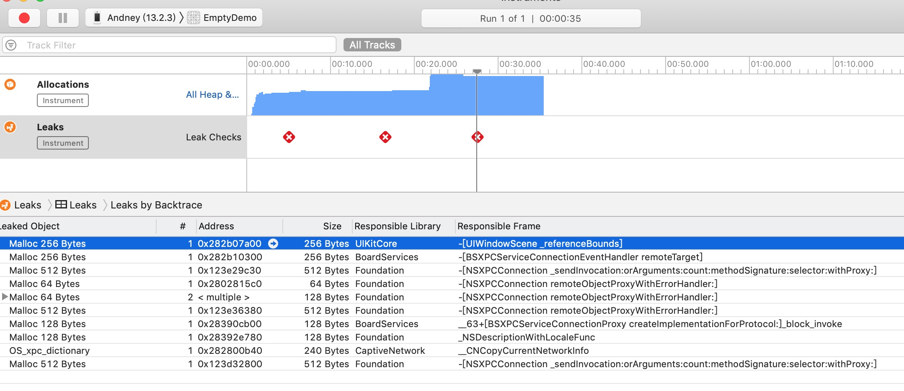

## 测试TIMSDK内存泄漏

> 会发生内存泄漏的机型：iPhone 7P（iOS 13.2.3）
> 
>  不发生内存泄漏的机型：iPhone 5（iOS 10.1.1）

#### 1. 开发环境

> TXIMSDK_iOS为最新版本：4.9.1
> 
> 手机为：iPhone 7P，iOS版本为13.2.3


#### 2. 重现步骤

1. 运行项目，进入首页
2. 点击“下一页”，在下一个界面，初始化SDK，然后返回上一页。发生内存泄漏



#### 3. 相关代码

```objc
#import "DetailViewController.h"
#import <ImSDK/ImSDK.h>

@interface DetailViewController () <V2TIMSDKListener>
@property (nonatomic, assign) BOOL didInitSDK;
@end

@implementation DetailViewController

- (void)viewDidLoad {
    [super viewDidLoad];
    [self addButtonsWithTitles:@[@"返回", @"初始化SDK", @"释放SDK"]];
}

- (void)actionButtonClick:(UIButton *)sender action:(NSString *)action {
    if ([action isEqualToString:@"返回"]) {
        [self closeViewController:YES];
    } else if ([action isEqualToString:@"初始化SDK"]) {
        if (!self.didInitSDK) {
            V2TIMSDKConfig *config = [[V2TIMSDKConfig alloc] init];
            config.logLevel = V2TIM_LOG_DEBUG;

            BOOL ret = [[V2TIMManager sharedInstance] initSDK:111111 config:config listener:self];
            NSLog(@"初始化结果：%d", ret);

            self.didInitSDK = YES;
        }
    } else if ([action isEqualToString:@"释放SDK"]) {
        if (self.didInitSDK) {
            [[V2TIMManager sharedInstance] unInitSDK];
            self.didInitSDK = NO;
        }
    }
}

// 返回上一页
- (void)closeViewController:(BOOL)animated {
    if (self.didInitSDK) {
        [[V2TIMManager sharedInstance] unInitSDK];
        self.didInitSDK = NO;
    }
    [super closeViewController:animated];
}
```
